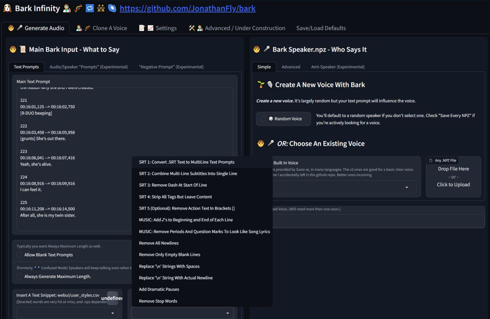

# 🚀 BARK INFINITY: A Voice Is A Sound and a Sound Is a Voice 🎶 🌈✨🚀 



### Colab Notebooks: These need updating, but they should work soon if they have a problem at the moment.
[](https://colab.research.google.com/github/steinhaug/bark-infinity/blob/main/notebooks/Bark-Infinity.ipynb)
[](https://colab.research.google.com/github/steinhaug/bark-infinity/blob/main/notebooks/Bark_Infinity_Long_Form_Audio_Colab.ipynb)

### Bark on an AMD GPU? 
Scroll down to [Bark AMD (DirectML) MANUAL Install](#bark-amd-directml-manual-install-)
# 🎉 Bark INFINITY NVIDIA Automatic Windows Installer 🎉  

### ⚠️ Note: make sure you fully extract the .zip file before running the .bat files.

## Bark Install Prerequisites: 

1. **Just the regular Windows NVIDIA drivers**. 
   1. You don't need anything else installed.
   2. You don't need Python.
   3. You don't need Pytorch. 
   4. You don't need anything with `CUDA` in the name.
   5. In fact, other Python/CUDA things on your system could cause problems, if those were not installed in isolated environment like a conda or venv.
   6. To check, you can try going to a command line and typing `python --version` or `pip list` and seeing what shows up. Ideally you want those commands to do nothing because that means nothing is installed on your base windows system itself.
2. *(Optional But Recommended)* **The Windows Terminal** https://apps.microsoft.com/store/detail/windows-terminal/9N0DX20HK701 -- Bark still has a lot of text output and it's looks nicer and is easier to read in the Windows Terminal. But you can also use the regular Windows Command Prompt. (Color text is coming back so you will want this later.)

## Bark Install Steps

1. Download the latest zip file from the releases page: https://github.com/JonathanFly/bark-installer/releases 
    * Direct Link: https://github.com/JonathanFly/bark-installer/releases/download/bark-infinity-v0.23b/bark-infinity-v0.23.zip
2. Extract the zip file into a directory with no spaces in the filename. This is the folder where Bark will be installed.
3. Click on `INSTALL_BARK_INFINITY.bat` (you do not need to be administrator)
4. If the install finished with no errors, close that terminal window. Close any other open command line windows as well. 
5. Click `START_BARK_INFINITY.bat` for the GUI version, or `COMMAND_LINE_BARK_INFINITY.bat` for the command line version.

## Bark Install Problems

1. **Windows permissions error**: Check for antivirus or security settings that may be blocking the installer. Can also be random and retrying the installer again simply fixes it.
2. **CondaSSLError, SSL Certificate Error**: This is an odd one. If your country or government has an online ID card, you may have to uninstall the government SSL certificates. 

### Install Trouble Shooting: 
1. Try `TROUBLESHOOT_BARK_INFINITY.bat` for some options.
2. **Still Not Working?** Feel free to @ me on Bark Official Discord, username "Jonathan Fly" jonathanfly.

## Bark Uninstall
  1. Delete the entire directory where you installed Bark.
     1. **⚠️** **Any Bark samples you made will be in that bark folder**, so be sure to save anything you want before deleting the bark folder.
  2. Delete the Bark models. The Bark models will be in your Huggingface Cache directory. The location should be printed when you run Bark in the console as `Bark Model Location:` or `HF_HOME` (for some older installs). The default location is `C:\Users\YourWindowsUserName\.cache\` in Windows. (You can generally delete anything in there and it will redownload if needed.) 

# Where Can I Get Bark Voices?

1. Search the [Bark Discord](https://suno.ai/discord) for voices. The Bark Discord is abuzz with Suno's new music 'Chirp' model, but you can find many great voices posted in chat in the months since Bark was released.
2. Bark Speaker Directory from rsxdalv: https://github.com/rsxdalv/bark-speaker-directory
3. You can nag me in Discord and if I'm online I might have some handy. 
4. Wait: I keep meaning to organize a bunch of good voices and update this repo.
# How To Make Bark Faster? 

1. **Tradeoff A Little Quality**: Use just the small **coarse** Bark model, leave other two models (**text** and **fine**) regular sized. You can do this in the Gradio UI or the command line with an option. 
2. **Try the new Huggingface Bark Implementation** and see https://huggingface.co/blog/optimizing-bark with optimization suggestions.
3. **Try Pytorch nightly**, if you know your way around the installation.
4. **Try optimizing numpy** and other related libraries **CPU** libraries, because bark may be bottlenecked somewhat on CPU. For example Intel MKL may be worth a shot so you could try something like this:
5. **Linux** (or WSL) seems generally a little faster than Windows, but I'm not sure if this is always true.

### Intel MKL Install: Maybe Faster? 

This is not part of the installer because it can break things, here for people who comfortable tweaking and rebuilding their Python conda environments.

1. Type `COMMAND_LINE_BARK_INFINITY.bat`
2. Type `python bark_perform.py --run_numpy_benchmark True` 
3. Note the benchmark times.
4. Install MKL exe in Windows itself. https://www.intel.com/content/www/us/en/developer/tools/oneapi/onemkl-download.html 
5. Install MKL in Python. Theres's a few different ways to install, one way you can try:
   1. Run `COMMAND_LINE_BARK_INFINITY.bat`
   2. Type:
      ```
      conda install -y mkl mkl-service mkl_fft libcblas liblapacke liblapack blas-devel mkl-include mkl_random mkl-devel mkl-include libblas=*=*mkl mkl-static intel-openmp blas=*=*mkl -c intel -c conda-forge --solver=libmamba
      ```
6. Rerun steps 1 and 2. Is it faster? If so, some chance Bark may be too.


### How To Make Bark Faster on CPU or Apple hardware?
1. On apple, try setting `SUNO_ENABLE_MPS` True
2. Watch this repo: https://github.com/PABannier/bark.cpp
3. New: Intel BigDL just added Bark: https://github.com/intel-analytics/BigDL/pull/9016

# Who Am I?
Sometimes I post at [twitter.com/jonathanfly](https://twitter.com/jonathanfly)


# 🎉Bark AMD (DirectML) MANUAL Install 🎉

An expensive AMD card will be a lot faster than using CPU, but a lot slower than a much less-expensive NVIDIA GPU like a 3060. If you really know your way around linux some people have reportedly compiled custom ROCm pytorch and say they got Bark working on AMD pretty decently - but there's no guide that I know of. This AMD install uses DirectML instead of of ROCm, easier but slower.

## Bark AMD DirectML Instructions.

What is DirectML? 
https://learn.microsoft.com/en-us/windows/ai/directml/gpu-pytorch-windows

Install Miniconda. https://repo.anaconda.com/miniconda/Miniconda3-py310_23.3.1-0-Windows-x86_64.exe

Then go to start menu and start a new "Ananconda Prompt" not regular windows command line 

```
conda update -y conda
conda update -y -n base conda
conda install -y -n base conda-libmamba-solver
conda create --name pydml_torch2 -y python=3.10.6
conda activate pydml_torch2
```

make sure you see (pydml_torch2) in the corner of of your prompt. 
***(pydml_torch2) C:\Users\YourName***

```
conda install -y pip git --solver=libmamba
conda update -y --all --solver=libmamba

pip install ffmpeg_downloader
ffdl install -U --add-path
```
Now quit out of the terminal and restart. We need ffmpeg in the path, which means you need to be able to type `ffmpeg -version` and have it work. If you close and restart, you should be able to do that.

So close the terminal, close all window command lines or terminals to be sure.
Then go back start menu and start a new "Ananaconda Prompt". This should be same you started the install.

```
conda activate pydml_torch2
```
**make sure you see (pydml_torch2) in the corner again**. ***(pydml_torch2) C:\Users\YourName*** etc.
You always want to see (pydyml_torch2) in the corner when installing and using Bark. If you don't see it from this point, you are in the wrong conda environment and need to type `conda activate pydml_torch2` again.


Now try typing
```
ffmpeg -version
```

Do you see ffmpeg 6.0? If it doesn't work you can keep going and you can use .wav file outputs, and fix it later.

Now the big conda install command. This could take 5 to 15 minutes, and if you have a slow internet it could even take hours, because it downloads multiple gigabytes. So if looks like it's frozen, let it go. Check your task manager and see if it's downloading. 

### For testing torch 2.0, just some giant pip installs:
```
pip install torch==2.0.0 torchvision==0.15.1 torch-directml==0.2.0.dev230426 opencv-python torchvision==0.15.1 wget pygments numpy pandas tensorboard matplotlib tqdm pyyaml boto3 funcy torchaudio transformers pydub pathvalidate rich nltk chardet av hydra-core>=1.1 einops scipy num2words pywin32 ffmpeg ffmpeg-python sentencepiece spacy==3.5.2 librosa jsonschema pytorch_lightning==1.9.4

pip install encodec flashy>=0.0.1 audiolm_pytorch==1.1.4 demucs 

pip install universal-startfile hydra_colorlog julius soundfile==0.12.1 gradio>=3.35.2 rich_argparse flashy>=0.0.1 ffmpeg_downloader rich_argparse devtools vector_quantize_pytorch

pip install https://github.com/Sharrnah/fairseq/releases/download/v0.12.4/fairseq-0.12.4-cp310-cp310-win_amd64.whl 
```

First set a SUNO_USE_DIRECTML variable. This tells Bark to use DirectML. If this doesn't work you can edit `/bark_infinity/config.py`` and set `SUNO_USE_DIRECTML`` to `True`` in the `DEFAULTS`` section.
```
set SUNO_USE_DIRECTML=1
```

Download Bark:
```
git clone https://github.com/JonathanFly/bark.git
cd bark
```
Change to the AMD Test Version

Note: (you may be able to skip `git checkout bark_amd_directml_test` and use main branch, if not, you will be able to soon)
```
git checkout bark_amd_directml_test
```
Now try running it. Bark has to download all the models the first time it runs, so it might look frozen for awhile. It's another 10 gigs of files. 
```
python bark_perform.py
```
When I tested this install, `bark_perform.py` seemed to freeze at downloading models without making progress. I don't know if was a fluke, but I ran `python bark_webui.py` and it downloaded them fine.

Start the Bark UI
```
python bark_webui.py
```

Things that don't work:
1. Voice Cloning (might work?)
2. Top_k and top_p
3. Probably more things I haven't tested. 

### Start Back UI Later
1. Click Anaconda Prompt in start menu
2. `conda activate pydml_torch2`
3. cd bark
4. `python bark_webui.py`
   


# ⚠️⬇️⬇️ Everything below this point is out of date - may have some useful info. ⬇️⬇️ ⚠️

## Manual Windows Mamba Install

(Mamba is a fast version of conda. They should work the same if you install either one, just change mamba to conda or vice-versa.)

Pip and conda/mamba are two _different_ ways of installing Bark Infinity. If you use **Mamba** do not install anything. Don't install _pytorch_, do not install anything with 'CUDA' in the same. You don't need to lookup a YouTube tutorial. Just type the commands. The only thing you need installed is the NVIDIA drivers. 

**Take note of which lines are for NVIDIA or CPU, or Linux or Windows.**

There is one exception, on Windows if you don't have the better Windows Terminal installed, that is a nice to have feature https://apps.microsoft.com/store/detail/windows-terminal/9N0DX20HK701

You don't have to but it may display the output from the bark commands better. When you start **Anaconda Prompt (miniconda3)** you can do it from the new Windows Terminal app, clicking on the down arrow next to the plus, should let you pick **Anaconda Prompt (miniconda3)**

1. Go here: [https://github.com/conda-forge/miniforge#mambaforge](https://github.com/conda-forge/miniforge#mambaforge)

2. Download a **Python 3.10 Miniconda3** installer for your OS.  Windows 64-bit, macOS, and Linux probably don't need a guide. 
  a. Install the **Mambaforge** for your OS, not specifically Windows. OSX for OSX etc.
  b. Don't install Mambaforge-pypy3. (It probably works fine, it is just not what I tested.) Install the one above that, just plain **Mambaforge**. Or you can use **Conda**, Mamba should faster but sometimes Conda may be more compatible. 
  
1. Install the **Python 3.10 Miniconda3** exe. Then start the miniforge **'Miniforge Prompt** Terminal which is a new program it installed. You will always use this program for Bark.
   
2. Start **'Miniforge Prompt**  Be careful not to start the regular windows command line. (Unless you installed the new Terminal and know how to switch.) It should say **"Anaconda Prompt (miniconda3)**"

You should see also terminal that says "**(base)**". 

### Do not move forward until you see _(base)_.

5. **Choose the place to install Bark Infinity directory.** You can also just leave it at default. If you make a LOT of audio you think about a place with a lot of space.

When you start **"Anaconda Prompt (miniconda3)"** you will be in a directory, in Windows, probably something like** "C:\Users\YourName"**. Okay to install there. Just remember where you put it. It will be in **/bark.** (If you already had bark-infinity installed and want to update instead of reinstalling, skip to the end.)

6. Type the next commands _exactly_. Hit "Y" for yes where you need to:

```
mamba update -y mamba
mamba create --name bark-infinity python=3.10
mamba activate bark-infinity

## NVIDIA GPU ONLY
mamba install -y -k cuda ninja git pip -c nvidia/label/cuda-11.7.0 -c nvidia 
pip install torch==2.0.1+cu117 torchvision torchaudio --index-url https://download.pytorch.org/whl/cu117
## END NVIDIA GPU ONLY

##### CPU ONLY LINES START HERE (Also MacOS)
mamba install -y -k ninja git
pip install torch torchvision torchaudio
##### CPU ONLY LINES END HERE (Also MacOS)


## WINDOWS ONLY fairseq
pip install fairseq@https://github.com/Sharrnah/fairseq/releases/download/v0.12.4/fairseq-0.12.4-cp310-cp310-win_amd64.whl

## NON-WINDOWS fairseq
mamba install fairseq

pip install audiolm_pytorch==1.1.4 --no-deps 

git clone https://github.com/JonathanFly/bark.git
cd bark

pip install -r barki-allpip.txt --upgrade
ffdl install -U --add-path
```

# Run Bark Infinity

## Run command line version
```
python bark_perform.py
```
## Run web ui version
```
python bark_webui.py
```

(If you see a warning that "No GPU being used. Careful, inference might be very slow!" after `python bark_perform.py` then something may be wrong, if you have GPU. If you *don't* see that then the GPU is working.)

# Start Bark Infinity At A Later Time

To restart later, start **Miniforge Prompt.** Not Regular Prompt. Make sure you see (base) You will type a command to activate **bark-infinity** and of base, like this:

```
mamba activate bark-infinity
cd bark
python bark_webui.py
```

# Update Bark Infinity 

```
git pull
pip install -r barki-allpip.txt --upgrade
```

# 🌟 Original Bark Infinity Launch README (Preserved Mostly For Amusement) 🌟

# 🌠 The Past: 🌠

Bark Infinity started as a humble 💻 command line wrapper, a CLI 💬. Built from simple keyword commands, it was a proof of concept 🧪, a glimmer of potential 💡.

# 🌟 The Present: 🌟

Bark Infinity _evolved_ 🧬, expanding across dimensions 🌐. Infinite Length 🎵🔄, Infinite Voices 🔊🌈, and a true high point in human history: [🌍 Infinite Awkwardness 🕺](https://twitter.com/jonathanfly/status/1650001584485552130). But for some people, the time-tested command line interface was not a good fit. Many couldn't even try Bark 😞, struggling with CUDA gods 🌩 and being left with cryptic error messages 🧐 and a chaotic computer 💾. Many people felt very… UN INFINITE. 

# 🔜🚀 The Future: 🚀

🚀 (**Non emoji real answer**: A node based UI like ComfyUI, if Gradio 4.0 makes Audio a lot better.)


### 1. INFINITY VOICES 🔊🌈
Discover cool new voices and reuse them. Performers, musicians, sound effects, two party dialog scenes. Save and share them. Every audio clip saves a speaker.npz file with the voice. To reuse a voice, move the generated speaker.npz file (named the same as the .wav file) to the "prompts" directory inside "bark" where all the other .npz files are.

🔊 With random celebrity appearances!

(I accidentally left a bunch of voices in the repo, some of them are pretty good. Use --history_prompt 'en_fiery' for the same voice as the audio sample right after this sentence.)

https://user-images.githubusercontent.com/163408/233747981-173b5f03-654e-4a0e-b71b-5d220601fcc7.mp4


### 2. INFINITY LENGTH 🎵🔄
Any length prompt and audio clips. Sometimes the final result is seamless, sometimes it's stable (but usually not both!).

🎵 Now with Slowly Morphing Rick Rolls! Can you even spot the seams in the most earnest Rick Rolls you've ever heard in your life?

https://user-images.githubusercontent.com/163408/233747400-b18411f8-afcb-437d-9288-c54cc2c95e62.mp4

### 🕺 Confused Travolta Mode 🕺
Confused Travolta GIF


Can your text-to-speech model stammer and stall like a student answering a question about a book they didn't read? Bark can. That's the human touch. The *semantic* touch. You can almost feel the awkward silence through the screen.

## 💡 But Wait, There's More: Travolta Mode Isn't Just A Joke 💡

Are you tired of telling your TTS model what to say? Why not take a break and let your TTS model do the work for you. With enough patience and Confused Travolta Mode, Bark can finish your jokes for you. 

https://user-images.githubusercontent.com/163408/233746957-f3bbe25f-c8f0-4570-97b1-1005e1b40cbe.mp4

Truly we live in the future. It might take 50 tries to get a joke and it's probably an accident, but all 49 failures are also *very* amusing so it's a win/win. (That's right, I set a single function flag to False in a Bark and raved about the amazing new feature. Everything here is small potatoes really.)

https://user-images.githubusercontent.com/163408/233746872-cac78447-8e87-49e7-b79b-28ec51264019.mp4


# Be sure to check out the official Suno repo README for updates as well

https://github.com/suno-ai/bark
